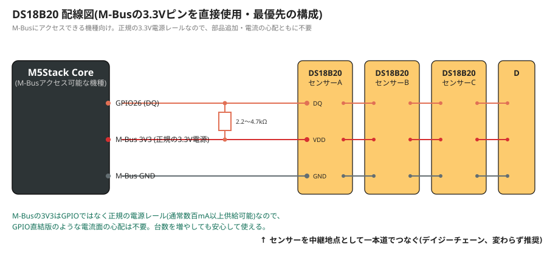
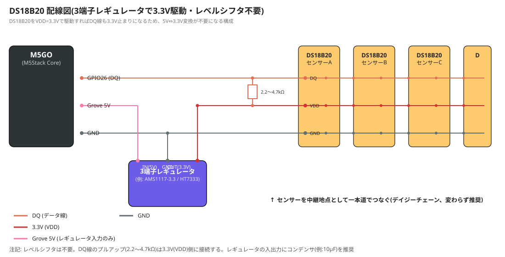
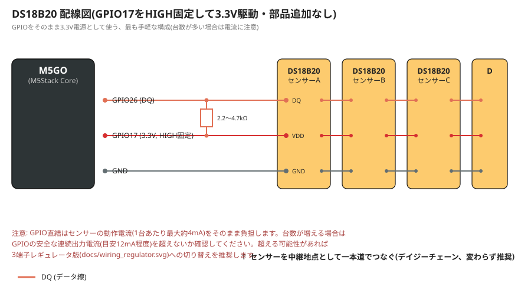
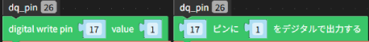
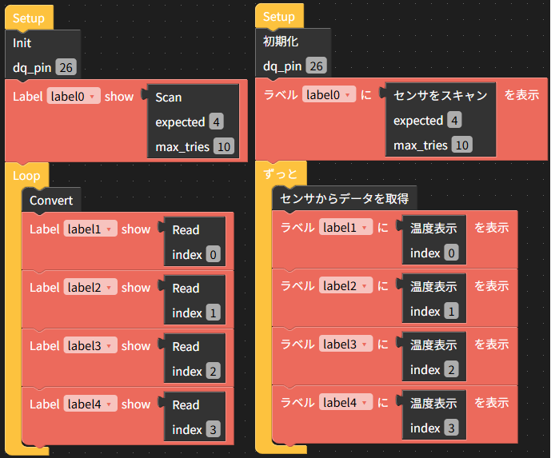

# ds18b20-multi-uiflow

M5Stack UIFlow1.0 向け、DS18B20 温度センサーの拡張ドライバ／カスタムブロックです。

[stonatm/UiFlow-custom-blocks](https://github.com/stonatm/UiFlow-custom-blocks/tree/master/ds18b20) をベースに、以下の機能を追加しています。

- **複数センサー対応(デイジーチェーン)**: 1本の1-Wireバスに複数のDS18B20をぶら下げて、それぞれ個別に温度を読み取れます(1-Wire ROM Search アルゴリズム実装)
- **CRCチェック**: 通信エラーを検出し、化けた値をそのまま返さないようにしています
- **パラサイト電源モード対応**: データ線から電源を取るパラサイトモードのセンサーにも対応(変換中の自動強プルアップ)。※実機未検証です
- **`_onewire`(ファームウェア内蔵Cモジュール)を使用**: 元の実装と同じく、UIFlowファームウェアに組み込まれた`_onewire`モジュール(ビット/バイト単位の1-Wire通信をCで実装したもの)を土台にしています。このモジュール自体はバイト単位の通信しか提供していないため、複数センサー探索(ROM Search)やCRCチェックといった上位のロジックは、こちらで新たに実装しています

## できること / できないこと

| 項目 | 対応状況 |
|---|---|
| 複数センサーの自動検出(スキャン) | ○ 実機検証済み |
| CRCチェック・リトライ | ○ 実機検証済み |
| パラサイト電源モード | △ 実装のみ、実機未検証 |
| 単一センサーでの利用 | ○ 実機検証済み |

## 動作環境

- M5Stack (M5GO, Core2, StickC など。UIFlowファームウェアが動作する機種)
- UIFlow1.0 (MicroPython 1.11系。`_onewire`モジュールが組み込まれているファームウェア)

## 配線図

複数センサーをつなぐ場合は、DQ線を「デイジーチェーン(直列)配線」にすること、DQ線とVDD(電源)間にプルアップ抵抗(2.2〜4.7kΩ)を入れることは、以下どの構成でも共通の推奨事項です。1点から複数方向にDQ線を分岐させる「スター配線」は信号反射により通信エラーが大幅に増加するため避けてください(検証済)。VDD線・GND線は分岐していても問題ありません(直流のため、こちらも検証済)。

`ds18b20_multi.py`自体はどの電源構成でも共通して使えます(電源の取り方はセンサーの動作とは無関係な、配線側で選ぶオプションです)。

### 最優先: M-Busの3.3Vピンから直接取る

もしM-Bus(本体裏面などから拡張ベース経由でアクセスできる場合)を使える機種・構成であれば、そこから3.3Vをそのまま取るのが一番確実です（[参考 M5Stack仕様](https://docs.m5stack.com/ja/core/basic)）。正規の電源レールなので、部品の追加も電流面の心配も不要です。この場合、DQ線とプルアップ抵抗、DS18B20のVDDをすべてこの3.3Vラインに接続するだけで完成します。



以下の3つの選択肢は、この理想形が使えない場合(M5GOのように、M-Busが拡張ベースで覆われていて5V専用のGrove端子しか使えない機種など)の代替策です。

構成は大きく2系統に分かれます。

- **3.3V駆動系**(推奨): DS18B20自体をVDD=3.3Vで駆動する。DQ線のプルアップ電圧も3.3V止まりになるため、レベルシフタ自体が不要になる
- **5V駆動+レベルシフタ**: DS18B20は5Vのまま、DQ信号だけを変換する。既存の5V電源をそのまま使いたい場合や、DS18B20を5V系の他の機器と共用する場合など、3.3V駆動が難しい事情があるときの代替アプローチ

### 基本: 3端子レギュレータ + 3.3V駆動

M-Busが使えない場合の、一番おすすめの構成です。GroveなどにあるGrove5VをAMS1117-3.3やHT7333のような3端子レギュレータで3.3Vに変換し、そこからDS18B20を駆動します。部品が1つ増えますが、電流に余裕があり、台数を増やしても安定します。



レギュレータの入出力にはコンデンサ(例: 10μF程度)を入れることを推奨します(無くても動くことが多いですが、電圧が不安定になりやすいです)。

### 簡易版: GPIO直結(部品追加なし)

3.3V駆動である点は同じですが、レギュレータの代わりにGPIO(例: GPIO17)を`machine.Pin(17, machine.Pin.OUT).value(1)`でHIGH固定し、そのまま3.3V電源として使う、最も手軽な構成です。部品の追加が一切不要なので、まず試してみたい・少数のセンサーだけ使う、という場合に向いています。



**注意**: この構成では、センサーの動作電流をGPIOがそのまま負担します(DS18B20は変換中に1台あたり最大約4mA)。ESP32のGPIOは安全な連続出力の目安が12mA程度なので、センサー台数が多い場合は電流不足で不安定になる可能性があります。台数を増やす予定がある場合は、上の「基本」構成(3端子レギュレータ)への切り替えを推奨します。

### 別案: レベルシフタ + 5V駆動

DS18B20を3.3Vで駆動するのが難しい/避けたい事情がある場合の構成です。Groveなどの5V電源で駆動しつつ、DQ線だけを双方向レベルシフタ(BSS138などの自動方向判定型)で3.3Vに変換してGPIOに接続します。


PortBのGPIO26をDQ、PortCのGPIO17をレベルシフタのVCCA用3.3V電源代わりに使っています(M5GOはM-Busにアクセスできないため、この例ではGPIOで代用しています)。プルアップ抵抗(2.2〜4.7kΩ)はレベルシフタのB面(5V側)のDQ-VCCB間に1箇所だけ入れます。

**74LS245のような、方向(DIR)を明示的に指定するバス・トランシーバICは使えません。** 1-Wireは双方向オープンドレイン信号のため、事前に方向を決められないプロトコルです。

## ハードウェア面の注意点

### プルアップ抵抗

DQ-VDD間に2.2kΩ〜4.7kΩ程度のプルアップ抵抗を入れてください。センサー台数や配線長に応じて、値を下げる(電流を増やす)方向で調整すると改善することがあります。

### デイジーチェーン配線(スター配線は避ける)

```
ESP32 ---- センサーA ---- センサーB ---- センサーC ---- センサーD   (○ デイジーチェーン)

ESP32 ─┬── センサーA
       ├── センサーB                                              (× スター配線)
       ├── センサーC
       └── センサーD
```

## ファイル構成

- `ds18b20_multi.py` — 単体で使えるMicroPythonライブラリ。UIFlowにファイル転送してimportして使う想定です
- `ds18b20_multi.m5b` — UIFlowのCustom(Beta)機能から読み込めるカスタムブロックファイル(`ds18b20_multi.py`のファイル転送不要、ブロック単体をUIFlow1.0で読み込むだけで完結)
- `docs/wiring_mbus.svg` — 配線図(最優先: M-Bus 3.3V版)
- `docs/wiring_regulator.svg` — 配線図(基本: 3端子レギュレータ版)
- `docs/wiring_gpio17.svg` — 配線図(簡易版: GPIO直結版)
- `docs/wiring.svg` — 配線図(別案: レベルシフタ版)

## 使い方: ライブラリを直接使う場合

```python
from ds18b20_multi import DS18B20, OneWireError
import machine, time

# レベルシフタのVCCA用に3.3Vが必要な場合の一例(3端子レギュレータやM5-Busの3V3ピンなど、
# 他の方法で3.3Vを供給しているならこの行は不要)
machine.Pin(17, machine.Pin.OUT).value(1)

sensor = DS18B20(26)  # DQ = GPIO26
roms = sensor.scan(check_crc=True)  # バス上の全センサーのROMコードを取得
print("検出台数:", len(roms))

last_temp = {}

while True:
    sensor.convert_temp()
    for rom in roms:
        try:
            t = sensor.read_temp(rom)
            last_temp[rom] = t
        except OneWireError:
            t = last_temp.get(rom)  # 通信エラー時は前回値にフォールバック
        print(rom, t)
    time.sleep(1)
```

## 使い方: UIFlowカスタムブロック

1. UIFlowの `Custom(Beta) > Open *.m5b file` から読み込み
2. `Init` ブロックでDQピン(dq_pin)を指定(電源の取り方はセンサーの動作とは無関係な配線側の選択なので、`Init`ブロックにはDQピンしか持たせていません。レベルシフタのVCCA用にGPIOをHIGH固定で3.3V代わりに使いたい場合は、`Init`より前に`machine.Pin(17, machine.Pin.OUT).value(1)`のような処理を別の実行コードブロックとして追加してください)

   

3. `Scan` ブロックで検出台数を確認(期待台数(expected / 0 だと無条件で見つかった数)・最大リトライ回数(max_tries / 期待台数検出しなかったらリトライする回数。検出がうまくいかず、エラーが出るようならリトライ数を増やす)を指定可能)
4. `Convert` → `Read` の順にブロックをつなげてループさせる(indexはセンサ番号 / 0～)

   なお、indexの値は、同じセンサ構成の場合は毎回同じになりますが、センサを増設、取り外し、交換した場合はindexの対応関係が変わる可能性があります。

   

## 謝辞 / 参考文献

- ベースとした元のカスタムブロック実装: [stonatm/UiFlow-custom-blocks](https://github.com/stonatm/UiFlow-custom-blocks)
- ROM Search アルゴリズム: Maxim Integrated Application Note 187, *"1-Wire Search Algorithm"*
- DS18B20 データシート: [Adafruit配布版PDF](https://cdn-learn.adafruit.com/assets/assets/000/130/351/original/DS18B20.pdf)

## ライセンス

MIT License. `LICENSE`ファイルを参照してください。ベースにした[stonatm/UiFlow-custom-blocks](https://github.com/stonatm/UiFlow-custom-blocks)もMIT Licenseで公開されているため、それに合わせています。
