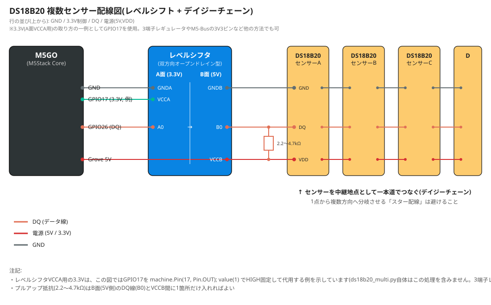
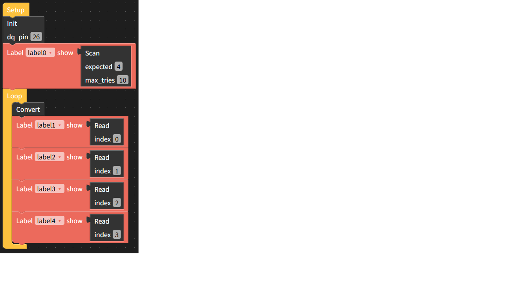
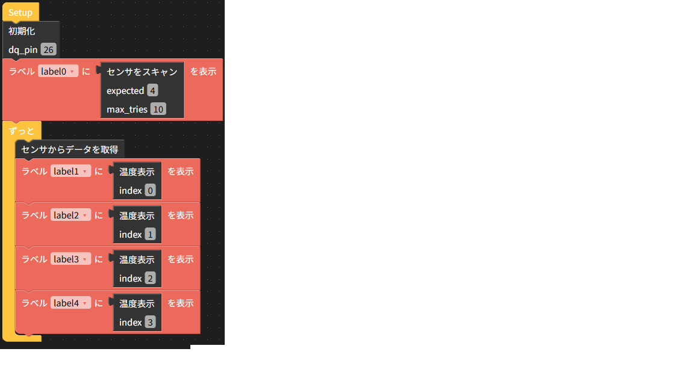

# ds18b20-multi-uiflow

M5Stack UIFlow1.0 向け、DS18B20 温度センサーの拡張ドライバ／カスタムブロックです。

[stonatm/UiFlow-custom-blocks](https://github.com/stonatm/UiFlow-custom-blocks/tree/master/ds18b20) をベースに、以下の機能を追加しています。

- **複数センサー対応(デイジーチェーン)**: 1本の1-Wireバスに複数のDS18B20をぶら下げて、それぞれ個別に温度を読み取れます(1-Wire ROM Search アルゴリズム実装)
- **CRCチェック**: 通信エラーを検出し、化けた値をそのまま返さないようにしています
- **パラサイト電源モード対応**: データ線から電源を取るパラサイトモードのセンサーにも対応(変換中の自動強プルアップ)。※実機未検証です
- **`_onewire`(ファームウェア内蔵Cモジュール)を使用**: 元の実装と同じく、UIFlowファームウェアに組み込まれた`_onewire`モジュール(ビット/バイト単位の1-Wire通信をCで実装したもの)を土台にしています。このモジュール自体はバイト単位の通信しか提供していないため、複数センサー探索(ROM Search)やCRCチェックといった上位のロジックは、こちらで新たに実装しています

## できること / できないこと

| 項目 | 対応状況 |
|---|---|
| 複数センサーの自動検出(スキャン) | ○ 実機検証済み |
| CRCチェック・リトライ | ○ 実機検証済み |
| パラサイト電源モード | △ 実装のみ、実機未検証 |
| 単一センサーでの利用 | ○ 実機検証済み |

## 動作環境

- M5Stack (M5GO, Core2, StickC など。UIFlowファームウェアが動作する機種)
- UIFlow1.0 (MicroPython 1.11系。`_onewire`モジュールが組み込まれているファームウェア)

## 配線図



M5GO → レベルシフタ(5V⇔3.3V) → DS18B20(デイジーチェーン)という構成の例です。PortBのGPIO26をDQ、PortCのGPIO17をレベルシフタのVCCA用3.3V電源代わりに使っています。M5-Busにアクセスできるようなら、3.3V出力があるので、そこから引き出すとよいでしょう（[参考 M5Stack仕様](https://docs.m5stack.com/ja/core/basic)）。例はM5GOなので、M5-Busにアクセスできないため、PortCのGPIO17ピンをHIGHにして3.3V電源にしています。もしくは、AMS1117-3.3やHT7333のような小型3端子レギュレータをGroveの5Vから3.3Vに変換して使うことでもよいと思います。プルアップ抵抗(2.2〜4.7kΩ)はレベルシフタのB面(5V側)のDQ-VCCB間に1箇所だけ入れます。

## ハードウェア面の注意点

安定した通信のために、以下を強く推奨します。特にセンサーの台数が増える場合は必須に近いです。

### 1. レベルシフタ(5V ⇔ 3.3V)

Groveポートなどから5V電源でDS18B20を駆動している場合、データ線(DQ)のアイドル電圧も5Vまで持ち上がり、3.3VロジックのESP32のGPIOには本来非対応な電圧がかかります。BSS138などを使った、双方向オープンドレイン対応の自動方向判定型レベルシフタ(いわゆるI2Cレベル変換モジュール)を挟んでください。

**74LS245のような、方向(DIR)を明示的に指定するバス・トランシーバICは使えません。** 1-Wireは双方向オープンドレイン信号のため、事前に方向を決められないプロトコルです。

### 2. デイジーチェーン配線(スター配線は避ける)

複数センサーを接続する際は、1点から複数方向にDQ線を分岐させる「スター配線」を避け、センサーを中継地点として1本道でつなぐ「デイジーチェーン配線」にしてください。スター配線は分岐点での信号反射により、通信エラーが大幅に増加します(検証済)。

```
ESP32 ---- センサーA ---- センサーB ---- センサーC ---- センサーD   (○ デイジーチェーン)

ESP32 ─┬── センサーA
       ├── センサーB                                              (× スター配線)
       ├── センサーC
       └── センサーD
```

VDD線・GND線は分岐していても問題ありません(直流のため)。気をつける必要があるのはDQ線だけです（こちらも検証済）。

### 3. プルアップ抵抗

DQ-VDD間に2.2kΩ〜4.7kΩ程度のプルアップ抵抗を入れてください。センサー台数や配線長に応じて、値を下げる(電流を増やす)方向で調整すると改善することがあります。

## ファイル構成

- `ds18b20_multi.py` — 単体で使えるMicroPythonライブラリ。UIFlowにファイル転送してimportして使う想定です
- `ds18b20_multi.m5b` — UIFlowのCustom(Beta)機能から読み込めるカスタムブロックファイル(`ds18b20_multi.py`のファイル転送不要、ブロック単体をUIFlow1.0で読み込むだけで完結)

## 使い方: ライブラリを直接使う場合

```python
from ds18b20_multi import DS18B20, OneWireError
import machine, time

# レベルシフタのVCCA用に3.3Vが必要な場合の一例(3端子レギュレータやM5-Busの3V3ピンなど、
# 他の方法で3.3Vを供給しているならこの行は不要)
machine.Pin(17, machine.Pin.OUT).value(1)

sensor = DS18B20(26)  # DQ = GPIO26
roms = sensor.scan(check_crc=True)  # バス上の全センサーのROMコードを取得
print("検出台数:", len(roms))

last_temp = {}

while True:
    sensor.convert_temp()
    for rom in roms:
        try:
            t = sensor.read_temp(rom)
            last_temp[rom] = t
        except OneWireError:
            t = last_temp.get(rom)  # 通信エラー時は前回値にフォールバック
        print(rom, t)
    time.sleep(1)
```

## 使い方: UIFlowカスタムブロック

1. UIFlowの `Custom(Beta) > Open *.m5b file` から読み込み
2. `Init` ブロックでDQピン(dq_pin)を指定（電源の取り方はセンサーの動作とは無関係な配線側の選択なので、`Init`ブロックにはDQピンしか持たせていません。レベルシフタのVCCA用にGPIOをHIGH固定で3.3V代わりに使いたい場合は、`Init`より前に`machine.Pin(17, machine.Pin.OUT).value(1)`のような処理を別の実行コードブロックとして追加してください)
3. `Scan` ブロックで検出台数を確認(期待台数(expected / 0 だと無条件で見つかった数)・最大リトライ回数(max_tries / 期待台数検出しなかったらリトライする回数。検出がうまくいかず、エラーが出るようならリトライ数を増やす)を指定可能)
4. `Convert` → `Read` の順にブロックをつなげてループさせる(indexはセンサ番号 / 0～)
　
## 謝辞 / 参考文献

- ベースとした元のカスタムブロック実装: [stonatm/UiFlow-custom-blocks](https://github.com/stonatm/UiFlow-custom-blocks)
- ROM Search アルゴリズム: Maxim Integrated Application Note 187, *"1-Wire Search Algorithm"*
- DS18B20 データシート: [Adafruit配布版PDF](https://cdn-learn.adafruit.com/assets/assets/000/130/351/original/DS18B20.pdf)

## ライセンス

MIT License. `LICENSE`ファイルを参照してください。ベースにした[stonatm/UiFlow-custom-blocks](https://github.com/stonatm/UiFlow-custom-blocks)もMIT Licenseで公開されているため、それに合わせています。
